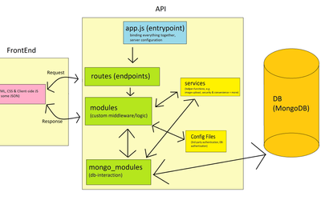

# Going Public

This project/site represents the culmination of various other hobby projects and templates etc that I have been working on. I attempted combining all the individual ones into one, complete, big one. There are, however, two reasons that I have not actually put the site online, other than this repository. 

1. Since I have given users the ability to upload personal information, however limited, I have to be able to make sure that this information could not possibly get into the wrong hands. However, my faith in my ability to do so is limited - my passion in coding does not lie in the security aspect (even though I think I at least am comfortable with the basics - i.e. hashing passwords, not storing the plain/raw ones in the database, storing database passwords in system variables and not directly in a database connection string as well as never uploading connection string, config files etc )
2. In order to put this site online, it would require a viable user interface - however, while I am capable of implementing a viable user interface, I have not gotten around to it yet. 
3. There still remains a little mess to be cleared up in terms of public/private routes

## Purpose of this project

**This site served as a way for me to play around with and gain experience with a wide range of aspects of Node.js, as well as client-side JavaScript. This includes among others**

 - Node.js as general runtime/framework for this project
 - Express.js as framework for both the API and management of frontend navigation, page-rendering etc
 - MongoDB for storing permanent information
 - Reading and Writing local (JSON) files server-side

**Among the most prominent aspects that i have worked with on this projects are the following:** 

 - User LogIn/LogOut & varios forms of authentication, including both local and third-party using passport.js (facebook, google & github)
 - "Security" such as hashing of passwords using the npm crypto module
 - Implemented my own forum, where users can create threads and post comments. Includes various statistics like number of threads per sub-forum, posts per thread, when the last post was made, who made it etc etc
 - Practiced various different kinds of CRUD operations (both client & server side). This includes both editing of personal information via a users profile, as well as editing of general information via a control panel.  
    - This also includes both practicing of both client-side and server-side validation, as well as validation-feedback to the user. 
 - Providing users with the ability to subscribe to newsletters. There is no actual newsletter, but the simulation of subscribing and un-subscribing is complete, including getting e-mails on whatever actual legitimate personal e-mail account that the user enters and using those to verify the subscription, getting information about having verified it and being able to unsubscribe again. 
 - Upload, Download & Resizing of images, as well as various kinds of validation. 
 - Logging of varios kinds of actions (just to simulate and nothing that would actually make sense in production)
 - Using JSON files to manage and dynamically load various kinds of ressources - among which are 
    - Breadcrumbs
    - Client-side JS files
    - CSS files

The last thing I played around with, was working on placing various admin/control panels on sub-domains. However, so far that has not ended up really working out for more than a single sub-domain at a time. It seems, that in this sense, the module I used has limitations, but I never got around to attempting the same with a different one. 

## Illustration of the site's/API's overall structure

For the sites overall architecture, I attempted to comply with the concepts of low coupling and high cohesion; effectively, designing the API and the overall server structure to be as modular as possible. This in an attempt to maximize maintainability and re-usability. 

